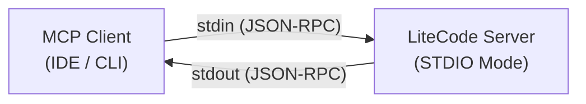
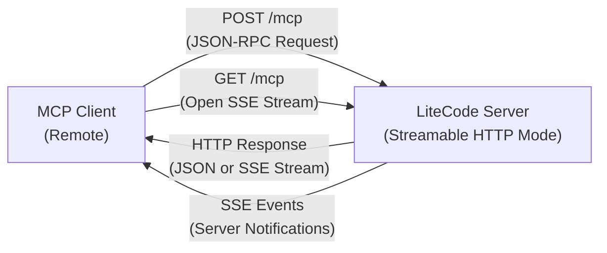
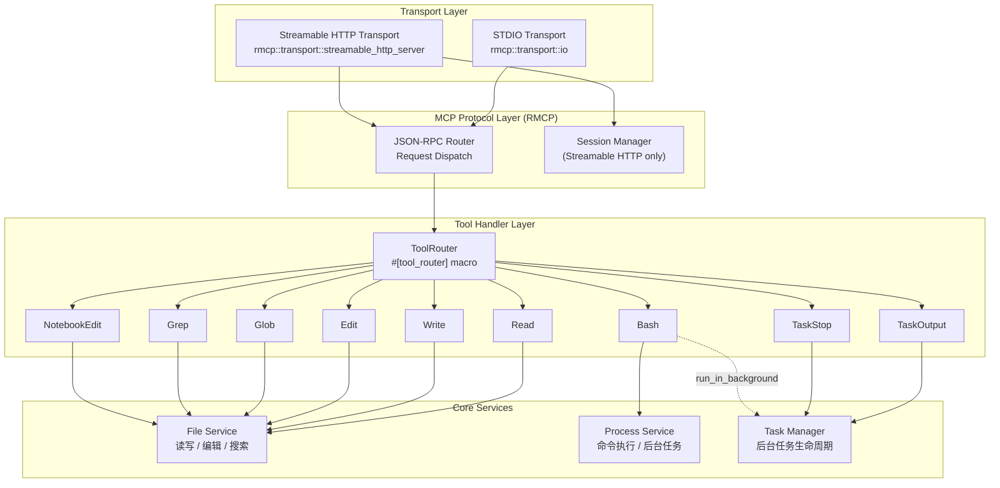
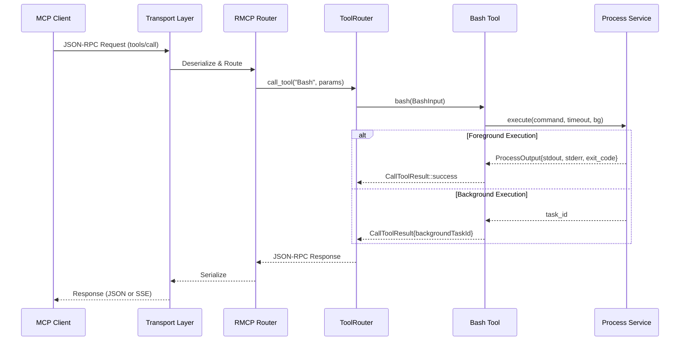

# LiteCode — 架构设计文档

## 文档概述

本文档基于 Product Requirements Document 协议规范，定义 LiteCode 的技术栈选型、软件架构设计和模块划分。

---

## 技术栈

| 类别 | 选型 | 说明 |
| --- | --- | --- |
| **编程语言** | Rust (Edition 2021+) | 零成本抽象、内存安全、极小二进制体积 |
| **MCP 框架** | RMCP (Rust MCP SDK) | 官方 Rust SDK，提供 `#[tool]` / `#[tool_router]` 宏、内置 STDIO 与 Streamable HTTP 传输 |
| **异步运行时** | Tokio | RMCP 的底层依赖，提供 async/await 运行时和任务调度 |
| **HTTP 框架** | Tower (via RMCP) | RMCP 的 Streamable HTTP 基于 Tower Service 抽象，可嵌入 Axum / Hyper |
| **序列化** | serde + serde_json | JSON-RPC 消息序列化与 Tool Schema 验证 |
| **文件搜索** | globwalk / glob | 实现 Glob 工具的文件模式匹配 |
| **内容搜索** | grep-regex / grep-searcher (ripgrep 核心库) | 实现 Grep 工具的正则搜索，复用 ripgrep 引擎 |
| **进程管理** | tokio::process | 异步子进程管理，用于 Bash 工具和后台任务 |
| **CLI 参数** | clap | 命令行参数解析，选择传输模式和配置 |
| **日志** | tracing + tracing-subscriber | 结构化日志，支持不同级别和输出格式 |

---

## MCP 传输层架构

LiteCode 支持两种传输模式，均由 RMCP 框架原生提供。

### STDIO 传输



- 通过 `rmcp::transport::io::stdio()` 创建
- 客户端通过子进程的 stdin/stdout 进行 JSON-RPC 通信
- 适用于本地 IDE 集成、CLI 工具、嵌入式 Agent
- **无需网络**，延迟最低

### Streamable HTTP 传输



- 通过 `rmcp::transport::streamable_http_server::StreamableHttpService` 创建
- **单一端点** (`/mcp`) 同时处理 POST 和 GET 请求
- **POST /mcp** — 客户端发送 JSON-RPC 请求，服务器可返回 JSON 响应或 SSE 流式响应
- **GET /mcp** — 客户端打开 SSE 长连接，接收服务器主动推送的通知
- 支持 **有状态模式**（会话管理，通过 `Mcp-Session-Id` Header 跟踪）和 **无状态模式**
- 支持 **会话恢复**（客户端通过 `Last-Event-ID` 断线重连）

### Streamable HTTP vs 传统 SSE（重要区分）

**Streamable HTTP ≠ 传统 SSE 传输。** 这是 MCP 协议中两种不同的传输方式，不应混淆。

| 特性 | **Streamable HTTP**（现代） | **传统 SSE**（已弃用） |
| --- | --- | --- |
| 端点数量 | **单一端点** `/mcp`（POST + GET） | **两个独立端点**：SSE 端点 + POST 消息端点 |
| 请求方式 | 客户端通过 POST 发送请求，服务器可返回纯 JSON 或 SSE 流 | 客户端先 GET 建立 SSE 连接获取 endpoint URL，再 POST 到该 URL |
| 服务器通知 | 客户端可选择通过 GET 打开 SSE 流接收通知，也可不使用 | SSE 连接是必须的，所有通信都依赖 SSE 通道 |
| 会话管理 | 通过 `Mcp-Session-Id` HTTP Header，支持有状态/无状态模式 | 通过 SSE 连接隐式绑定，连接断开即丢失会话 |
| 可恢复性 | 支持 `Last-Event-ID` 和事件重放 | 不支持 |
| 纯 JSON 模式 | 支持 `enableJsonResponse`，完全不使用 SSE | 不支持，必须使用 SSE |
| 状态 | **MCP 协议推荐方式** | **已弃用**（Legacy） |

> LiteCode **仅实现 Streamable HTTP**，不实现传统 SSE 传输。这与 PRD 要求一致，同时确保遵循 MCP 协议最新规范。

### RMCP 传输层配置

```rust
// Streamable HTTP 服务器配置
StreamableHttpServerConfig {
    sse_keep_alive: Some(Duration::from_secs(15)),  // SSE 心跳间隔
    sse_retry: Some(Duration::from_secs(3)),         // SSE 重连间隔
    stateful_mode: true,                             // 启用会话管理
    cancellation_token: CancellationToken::new(),    // 优雅关闭
}
```

---

## 整体架构



---

## 模块设计

### 项目结构

```
litecode/
├── Cargo.toml
├── src/
│   ├── main.rs              # 入口：CLI 解析 + 传输模式选择
│   ├── server.rs            # MCP Server 初始化与 ServerHandler 实现
│   ├── tools/
│   │   ├── mod.rs           # ToolRouter 注册（#[tool_router] 宏）
│   │   ├── bash.rs          # Bash 工具
│   │   ├── read.rs          # Read 工具
│   │   ├── write.rs         # Write 工具
│   │   ├── edit.rs          # Edit 工具
│   │   ├── glob.rs          # Glob 工具
│   │   ├── grep.rs          # Grep 工具
│   │   ├── notebook.rs      # NotebookEdit 工具
│   │   ├── task_output.rs   # TaskOutput 工具
│   │   └── task_stop.rs     # TaskStop 工具
│   ├── services/
│   │   ├── mod.rs
│   │   ├── file_service.rs  # 文件读写、路径验证、权限检查
│   │   ├── process.rs       # 子进程执行、超时管理
│   │   └── task_manager.rs  # 后台任务注册、状态查询、取消
│   ├── transport/
│   │   ├── mod.rs
│   │   ├── stdio.rs         # STDIO 传输启动逻辑
│   │   └── http.rs          # Streamable HTTP 传输启动逻辑
│   ├── schema/
│   │   ├── mod.rs
│   │   ├── input.rs         # 各工具的输入参数结构体 (serde)
│   │   └── output.rs        # 各工具的输出结构体 (serde)
│   └── error.rs             # 统一错误类型
```

### 模块职责

#### 1. Transport 模块 (`transport/`)

负责传输层的初始化和配置。

```rust
// transport/stdio.rs
pub async fn serve_stdio(handler: LiteCodeServer) -> Result<()> {
    let service = handler.serve(rmcp::transport::io::stdio()).await?;
    service.waiting().await?;
    Ok(())
}

// transport/http.rs
pub async fn serve_http(handler: LiteCodeServer, bind: SocketAddr) -> Result<()> {
    let config = StreamableHttpServerConfig {
        stateful_mode: true,
        sse_keep_alive: Some(Duration::from_secs(15)),
        ..Default::default()
    };
    let service = StreamableHttpService::new(
        move || handler.clone(),
        config,
    );
    let router = axum::Router::new()
        .route("/mcp", any_service(service));
    let listener = tokio::net::TcpListener::bind(bind).await?;
    axum::serve(listener, router).await?;
    Ok(())
}
```

#### 2. Server 模块 (`server.rs`)

核心 MCP Server 定义，使用 RMCP 的宏系统。

```rust
#[derive(Clone)]
pub struct LiteCodeServer {
    tool_router: ToolRouter<Self>,
    file_service: Arc<FileService>,
    task_manager: Arc<TaskManager>,
    working_dir: Arc<Mutex<PathBuf>>,
}

#[tool_handler]
impl ServerHandler for LiteCodeServer {
    fn get_info(&self) -> ServerInfo {
        ServerInfo {
            name: "litecode".into(),
            version: env!("CARGO_PKG_VERSION").into(),
            ..Default::default()
        }
    }
}
```

#### 3. Tools 模块 (`tools/`)

每个工具使用 `#[tool]` 宏声明，自动生成 JSON Schema。

```rust
#[tool_router]
impl LiteCodeServer {
    #[tool(
        name = "Bash",
        description = "Executes a given bash command and returns its output."
    )]
    async fn bash(
        &self,
        #[tool(param)] params: BashInput,
    ) -> Result<CallToolResult, McpError> {
        // 委托给 process service
    }

    #[tool(
        name = "Read",
        description = "Reads a file from the local filesystem."
    )]
    async fn read(
        &self,
        #[tool(param)] params: ReadInput,
    ) -> Result<CallToolResult, McpError> {
        // 委托给 file service
    }

    // ... 其余 7 个工具
}
```

#### 4. Services 模块 (`services/`)

- FileService — 文件操作核心
    - **读取**：支持文本文件（带行号）、图片（Base64 编码）、PDF（按页读取）、Jupyter Notebook（解析 JSON 结构）
    - **写入**：创建/覆盖文件，强制执行"先读后写"规则
    - **编辑**：精确字符串替换，支持单次/全局替换，验证 `old_string` 唯一性
    - **路径验证**：所有路径必须为绝对路径，禁止目录遍历攻击
- Process Service — 进程执行引擎
    - 使用 `tokio::process::Command` 异步执行 shell 命令
    - **工作目录持久化**：相同会话跨命令保持 cwd
    - **超时管理**：默认 120s，最大 600s，通过 `tokio::time::timeout` 实现
    - **后台执行**：`run_in_background=true` 时注册到 TaskManager
- TaskManager — 后台任务管理器
    - 维护 `HashMap<String, TaskHandle>` 存储活跃任务
    - **TaskOutput**：阻塞/非阻塞获取任务输出
    - **TaskStop**：通过 `CancellationToken` 或 kill signal 终止任务
    - 自动清理已完成任务的资源

---

## 数据流

### 工具调用时序（以 Bash 为例）



---

## 错误处理策略

所有错误映射为 MCP 标准的 `ErrorData`，保证永远返回结构化 JSON-RPC 错误响应，**不会 panic**。

| 错误类型 | 处理方式 | JSON-RPC Error Code |
| --- | --- | --- |
| 无效参数 | 参数校验失败，返回具体字段信息 | `-32602` (Invalid params) |
| 文件未找到 | 返回路径和错误描述 | `-32000` (Server error) |
| 权限拒绝 | 返回操作类型和目标路径 | `-32000` (Server error) |
| 执行超时 | 终止子进程，返回已捕获的部分输出 | `-32000` (Server error) |
| 先读后写违规 | Edit/Write 调用前未 Read，拒绝操作 | `-32602` (Invalid params) |
| 编辑冲突 | `old_string` 匹配多处且未设 `replace_all` | `-32000` (Server error) |

---

## 入口与 CLI

```rust
/// LiteCode CLI
#[derive(Parser)]
#[command(name = "litecode", about = "Ultra-lightweight Coding MCP Server")]
struct Cli {
    /// Transport mode
    #[command(subcommand)]
    transport: TransportMode,
}

#[derive(Subcommand)]
enum TransportMode {
    /// Run with STDIO transport (default)
    Stdio,
    /// Run with Streamable HTTP transport
    Http {
        /// Bind address
        #[arg(long, default_value = "127.0.0.1:8080")]
        bind: SocketAddr,
    },
}
```

**启动示例**：

```bash
# STDIO 模式（本地 IDE 集成）
litecode stdio

# Streamable HTTP 模式（远程服务器）
litecode http --bind 0.0.0.0:3000
```

---

## 性能设计

| 指标 | 目标 | 实现方式 |
| --- | --- | --- |
| 二进制体积 | < 10 MB | Release + strip + LTO，精选依赖避免膨胀 |
| 冷启动 | < 100 ms | 无运行时反射、最小初始化逻辑 |
| 工具分发延迟 | < 5 ms | ToolRouter 静态分发，零动态查找开销 |
| 并发能力 | 多请求并行 | Tokio 异步 + Arc 共享状态，无全局锁瓶颈 |

### Cargo 优化配置

```toml
[profile.release]
opt-level = "z"       # 优化体积
lto = true             # 链接时优化
codegen-units = 1      # 单代码生成单元
strip = true           # 剥离调试符号
panic = "abort"        # 减少 panic 处理代码
```

---

## 依赖清单 (`Cargo.toml`)

```toml
[dependencies]
rmcp = { version = "*", features = [
    "server",
    "macros",
    "transport-io",
    "transport-streamable-http-server",
] }
tokio = { version = "1", features = ["full"] }
serde = { version = "1", features = ["derive"] }
serde_json = "1"
axum = "0.8"
clap = { version = "4", features = ["derive"] }
tracing = "0.1"
tracing-subscriber = { version = "0.3", features = ["env-filter"] }
globwalk = "0.9"
grep-regex = "0.1"        # ripgrep 正则引擎
grep-searcher = "0.1"     # ripgrep 搜索器
tokio-util = "0.7"        # CancellationToken
```

---

## 构建与跨平台

| 目标平台 | Target Triple | 说明 |
| --- | --- | --- |
| Linux (x86_64) | `x86_64-unknown-linux-gnu` | 主要部署平台 |
| macOS (Apple Silicon) | `aarch64-apple-darwin` | 开发环境 |
| macOS (Intel) | `x86_64-apple-darwin` | 兼容旧机型 |
| Windows | `x86_64-pc-windows-msvc` | Windows 开发支持 |

使用 GitHub Actions 进行 CI/CD，通过 `cross` 或 `cargo-zigbuild` 实现跨平台编译。
